# PROJECT Design Documentation

## Team Information
* Team name: Bobby Fanclub (team 2)
* Team members
  * Dakota Fedor
  * Ryan Symons
  * Hiro Takeuchi
  * Caity Kurutz
  * Sahil Patel

## Executive Summary

We are designing and developing a musical instrument online store, where you can browse and purchase musical instruments of your choice. Users can sign up for new accounts and login with them again. Users can view all available instruments in stock and add products to their cart. Buyers also have an account page where they can edit their account information and add credit cards/shipping information. They can then use their saved credit card information/shipping addresses to checkout their cart. After checking out, they can view the order to see what was purchased, what card was used, and what address it was shipped to. Admins have the capability to see panels for viewing and modifying: products, accounts, and past orders.

### Purpose
The purpose of this project is to develop a full frontend and backend system that operates an e-store on a website hosted locally on a machine.

### Glossary and Acronyms

| Term | Definition |
|------|------------|
| MVP | Minimum Viable Product |

## Requirements

This section describes the features of the application.

### Definition of MVP
At a minimum, the website should provide minimal authentication for customers and owners/administrators (logging in and out). Customers should be able to see the products, search for specific products, as well as adding or removing these products to a shopping cart. Finally, customers should be able to check out the items in their shopping cart for purchase. Owners should be able to edit the data of their inventory to correctly align with their current stock. The server should be able to handle requests made by customers and update what is viewed on the website accordingly, such as when an item is purchased, all customers should be able to see the change in stock.

### MVP Features
Hermoine’s Harmonics implements the MVP features in the following ways:

#### Minimal Authentication:
For Hermoine’s Harmonics, we implemented a login and sign-in page.  On the login page, you enter an email address and a password to log into your account.  From there, you can access your past orders and your saved cart.  If you do not have an account, you may create one on the sign-in page, which gives you the user abilities.  However, there is also an admin login that grants you access to modifying the inventory and viewing all of the orders made by customers.  On that page, you may change the status of the order, for example, whether it is delivered or still being processed.

#### Customer Functionality:
On the home page, whether the consumer is signed in or not, you can see the list of products that the owner has implemented in the inventory.  There is a “search” button at the top right of the page that you can click and it takes you to a search bar.  A customer can enter the name of a product or one of its product tags, and those corresponding products will show.  To add something to your cart, you must create an account so it can be saved.  If the user would like, they can go to the “cart” tab under the user menu to view, remove items, and checkout.  During checkout, the website asks you to select a shipping address and a credit card.  When you submit your information, it creates an order for that user that can then be viewable in the user menu and by the admin.

#### Inventory Management:
The admin can go to their user menu and select to view the inventory.  From there, they see a list of products that have their corresponding information in text fields.  The text fields are editable, so the owner can change the name, description, fields, price, and quantity of each item.  Next to each item there is a delete button, in case the admin does not carry that product anymore.  There is also a prompt at the top of the page that allows the admin to create a new product with all of the aforementioned information.
Data Persistence:
Whenever a user logs out with items in their cart, it is stored in a JSON file with the buyer information.  Whenever the user logs back in, those items are loaded back into the cart from the JSON by using the BuyerInfoDAO and the BuyerInfoService.  All of the other buyer information is stored in the same manner, so that is also how the account editing page loads and the past orders load.

### Epic: Owner
*  **Inventory Control** (As an Owner I want to update inventory so customers can stay updated on as well as purchase in-stock products.)
*  **Admin Login** (As an Owner I want to be able to login with my username so that I can access administrative privileges to update the inventory.)
*  **Order Status [Admin]** (As an Owner I want to be able to change the status of customer orders (Order Placed, Shipped, Received, Refunded) so that I can determine what tasks need to be completed.)
*  **View Orders [Admin]** (As an Owner I want to be able to view orders so that I can view the orders that customers place.)
*  **Create Categories** (As an Owner I want to be able to create the categories for the inventory so that I can organize items under the specified categories.)

### Epic: Buyer Account
*  **View Past Orders** (As a buyer I want to be able to view my past orders so that I can see what I’ve already ordered, and to confirm that I’ve ordered something.)
* **Manage Appearance** (As a buyer I want to be able to list personal information so that my account has useful data regarding me and ways to contact me.)
* **Store/Utilize Payment Methods** (As a buyer I want to be able to store various payment methods so that I can both not have to re-enter my credit card information multiple times, and so I can have multiple methods of payment on file.)

### Enhancements

Our enhancements include the following:

#### Sort By:
The sort by methods that we implemented allow customers to search through certain categories. The attributes you can sort by are price, alphabetical, and popularity. Each can be ordered in descending order or ascending order and the user will see the whole inventory sorted. Along with these specific traits that items can be sorted by, an owner can also choose to create a custom tag to associate that item with. These tags can only be created by owners hence they are called owner-created categories. Similarly the owner can remove them as needed. Customers can search through these categories making it easier to search for a specific item.

#### Orders:
The order system allows customers to view information about a purchase made at a specific time. Users can view the date, id, status of order, products in the order,  and last four digits of the credit card used to purchase the products. Admins can also view this page to gather information about changes in stock as well as success of the e store.

## Application Domain

This section describes the application domain.

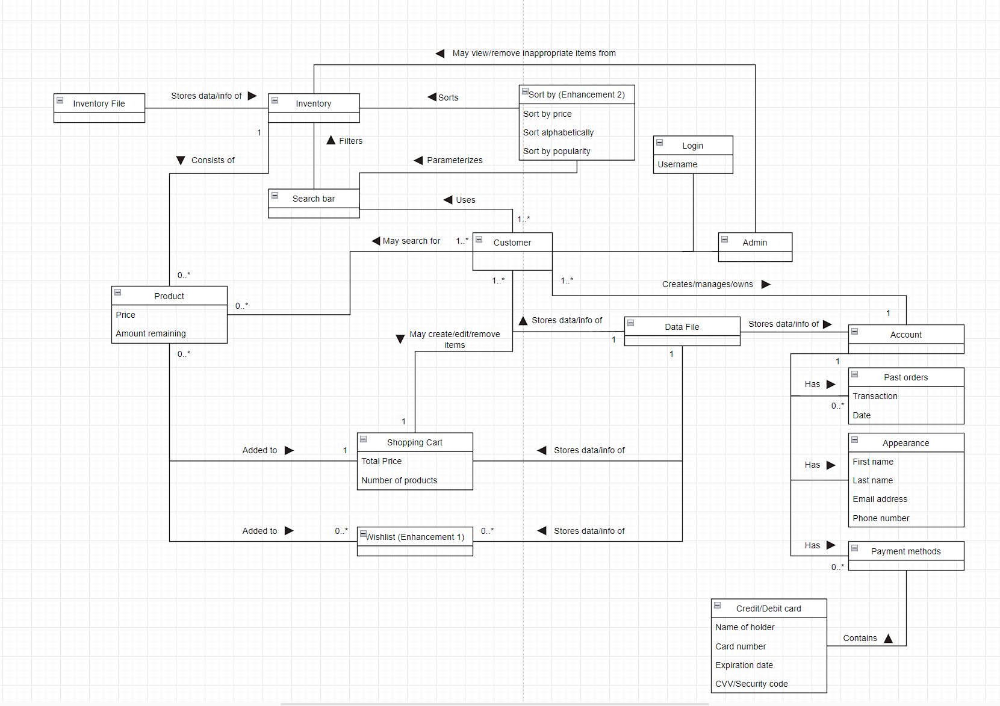

Given a login, you should be able to sign in as either a customer or an admin(owner). As an admin, you may view the inventory and make changes to it as you see fit. As a customer, you should also be able to view the inventory, search for products using a search bar (which will contain premade sort by components), and add products to your shopping cart or wishlist. Inventory and customer data will be stored in there own separate files, with the customer data file storing account information where you can view past orders, general user information, and payment methods.

## Architecture and Design

This section describes the application architecture.

### Summary

The following Tiers/Layers model shows a high-level view of the webapp's architecture.

The e-store web application is built using the Model–View–ViewModel (MVVM) architecture pattern. 

The Model stores the application data objects including any functionality to provide persistence. 

The View is the client-side SPA built with Angular utilizing HTML, CSS and TypeScript. The ViewModel provides RESTful APIs to the client (View) as well as any logic required to manipulate the data objects from the Model.

Both the ViewModel and Model are built using Java and Spring Framework. Details of the components within these tiers are supplied below.

### Overview of User Interface

When a new user goes to the website, they will be greeted with the default page which is the product listing.

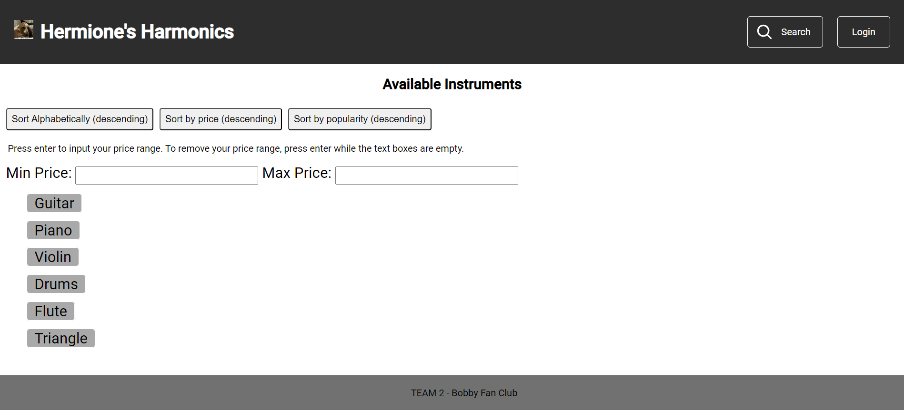

Even without an account, the user can still view the product listing, as well as sort them or search for them. Buttons are available which sort the entire listing either alphabetically or by price or by popularity. There are also options to limit the search to a given price range.

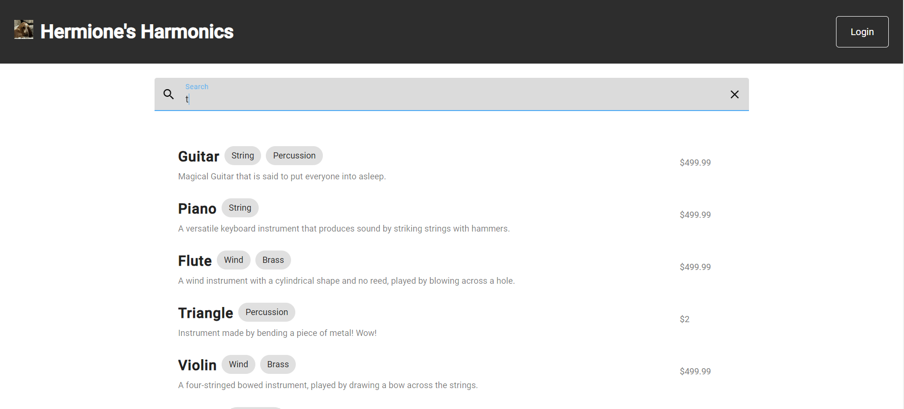

Users can search for products by their name, description, or tags. Clicking on a product here (or in the general product listing page) will lead to a detail page.

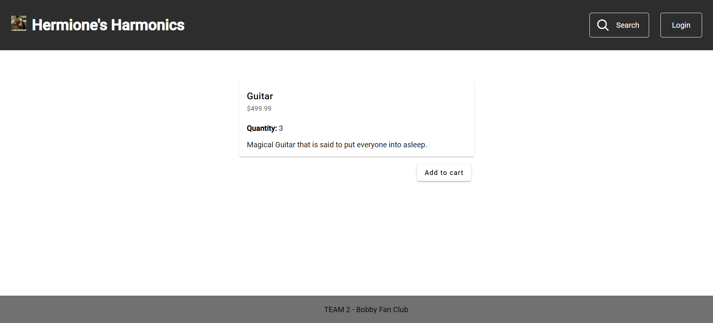

Clicking on an individual product in the product listing page leads to a separate page where the user can view the price and the stock of the product. Clicking the e-store title, “Hermione’s Harmonics” will lead back to the product page.

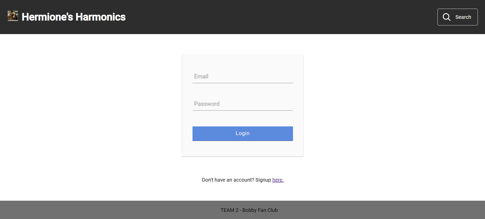

Clicking the login button at the top right will lead to this page, where a user can enter in their information to log in with an account, or create one. If a user has not created an account, then they can click the link at the bottom of the screen which will lead to a separate (but similar looking) page where they can create an account with an email/password.

Either by clicking the “My Account” button in the top right dropdown, or by creating an account, the user is routed to the account page. Here they can edit their personal information (name and phone number) along with their saved credit cards and shipping addresses.

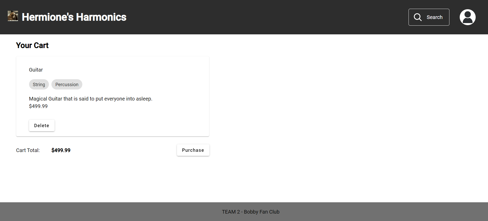

By clicking the “My Cart” button in the top right dropdown, the user can navigate to their cart. Items are added to the cart by clicking the “Add to Cart” button in the product detail page. The cart will display all items that are added to the cart. Items in the cart can be deleted by pressing the delete button twice. After a customer is satisfied with the items, they can click the purchase button.

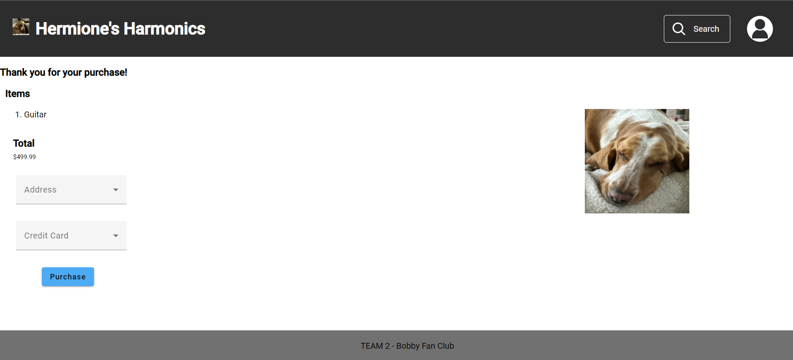

On the purchase page, the user is greeted with a simple list of the items they are purchasing, along with dropdowns to select which shipping address and credit card they wish to use for the purchase.

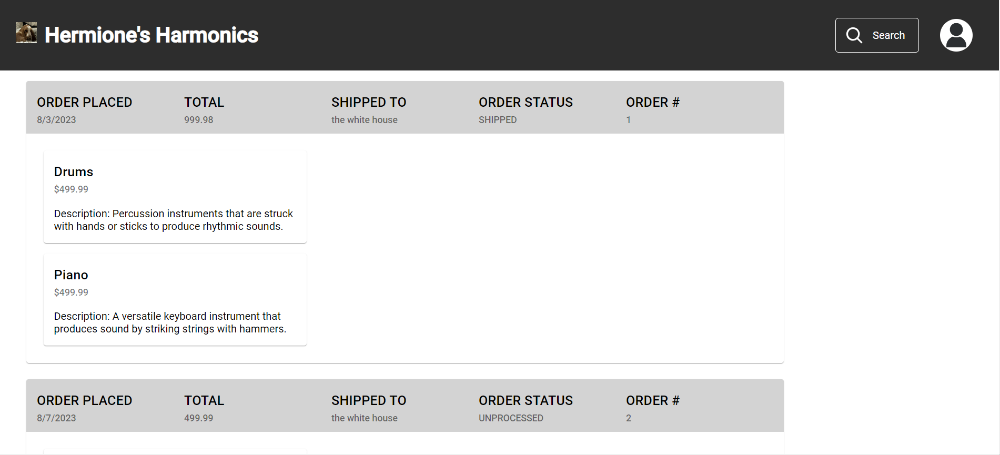

Either by clicking the “Past Orders” button in the top right dropdown, or by completing a purchase, the user is routed to the past orders page. Here they can view all past purchases they have placed. Pertinent information is displayed for each order to tell the user which order is which. 

Users can also logout by clicking on the “Logout” button in the top right dropdown.

Admins can log in by using the generic information: admin/admin. By logging in with this information, this website instance has access to additional features.

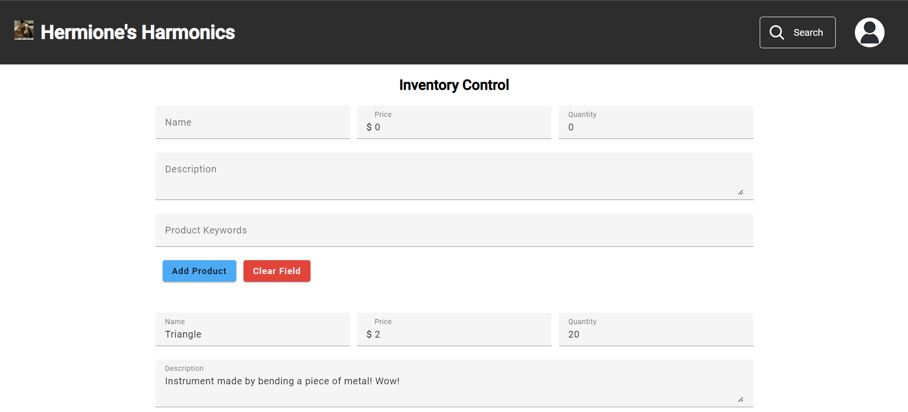

By clicking the “Inventory” button in the top right dropdown, admins can view a different inventory page which gives the ability to create/edit/delete products from the listing.

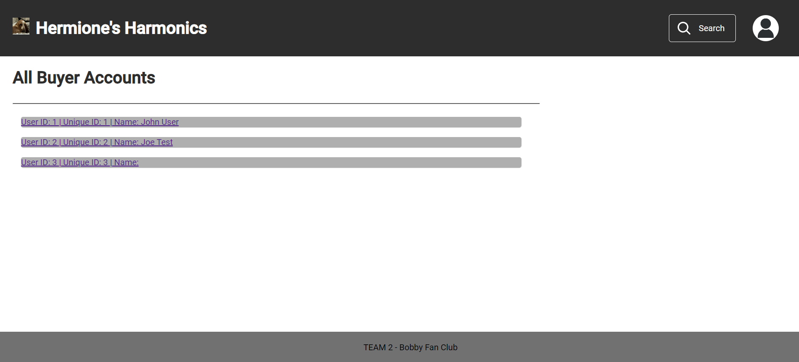

By clicking the “Accounts” button in the top right dropdown, admins can view a listing of all buyer accounts, with a link to each one.

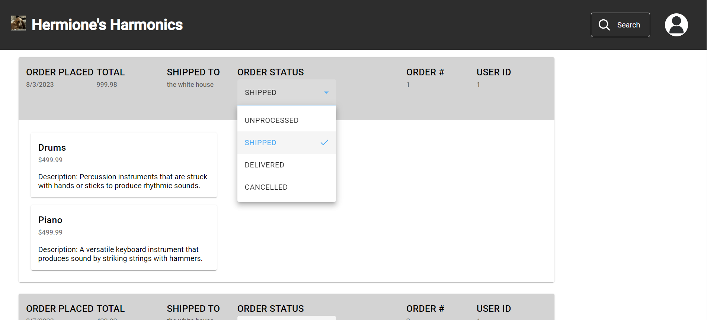

By clicking the “Orders” button in the top right dropdown, admins can view a list of all orders placed on the e-store. Additionally, they can manually edit the order status of each individual order, so that a customer can see the status of their purchase.

### View Tier

Our view tier has many components which all carry out different tasks. We have a general “component” and “screen” directories which contain all Angular components that are necessary to display information to the user. They contain the HTML, CSS, and Typescript files that manage the frontend itself. There is a separate folder for the jwt interceptor which handles some of the authorization for the project. The service folder contains all the services which is the way that the frontend connects to the backend. Components use the service to get information from the backend so it can be displayed on the frontend. Finally, there are the general typescript files which just reside in the apps file that control routing, general types, and imported libraries.	

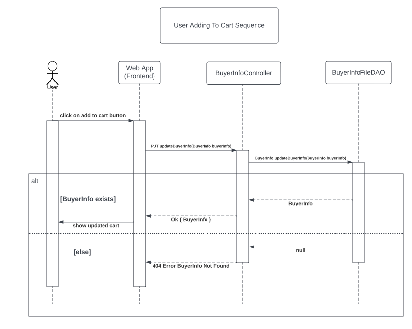

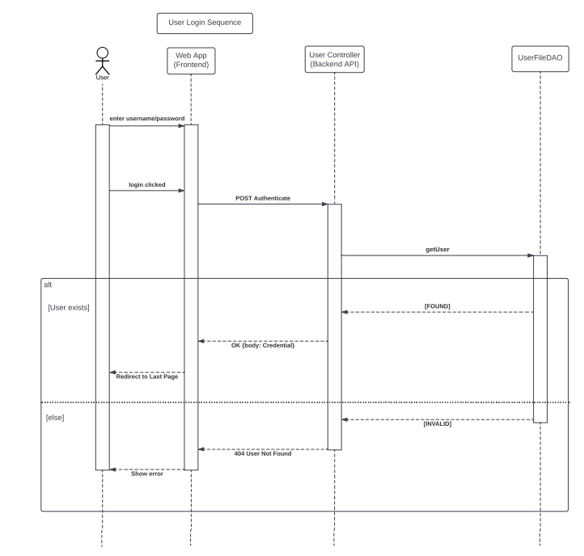

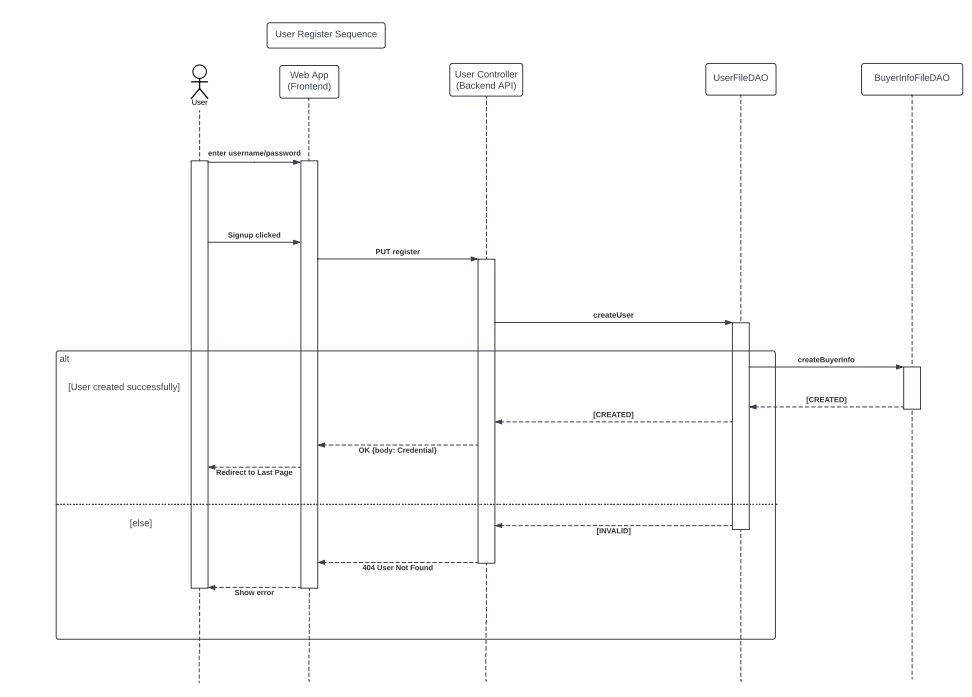

### ViewModel Tier

The ViewModel Tier consists of the Rest API controllers that communicate with the frontend. They send out response entities by using methods in their respective DAO to receive data.
Our project consists of four controllers, Authentication Controller which handles login/authentication matters, BuyerInfoController which handles buyer information and account details, InventoryController which handles product information, and finally OrderController which handles past orders.

For example, the InventoryController file has methods to deal with product features: get, create, update, destroy. All methods return a response entity back to the frontend, which is how the frontend receives the data. 

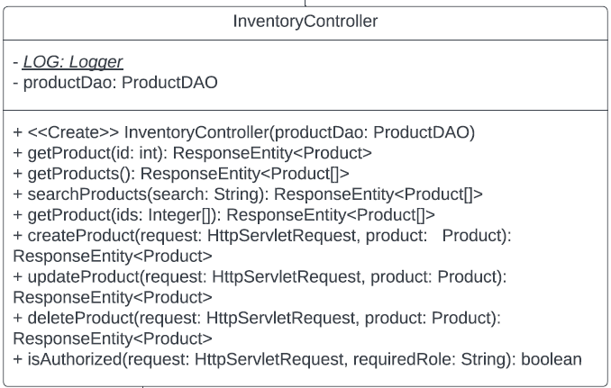

### Model Tier

The Model Tier consists of various elements of the backend which are made up of classes which represent differing types of data. Data is mostly represented in separate classes such as: BuyerInfo, which captures information related to each buyer, CreditCard, which holds a user’s credit card information for making purchases and transactions, Order, which contains information about a purchase being made, Product, which contains information about products, as well as User, which stores a customers personal information.Each of these classes has a separate DAO file, which writes and stores this information into data files.

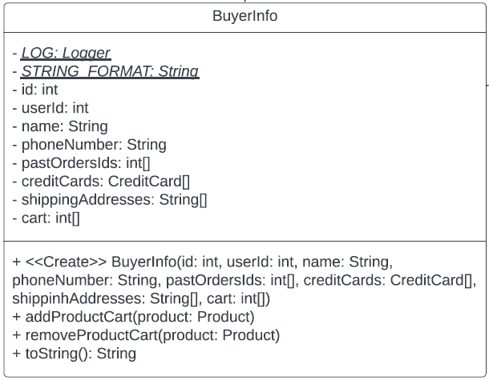
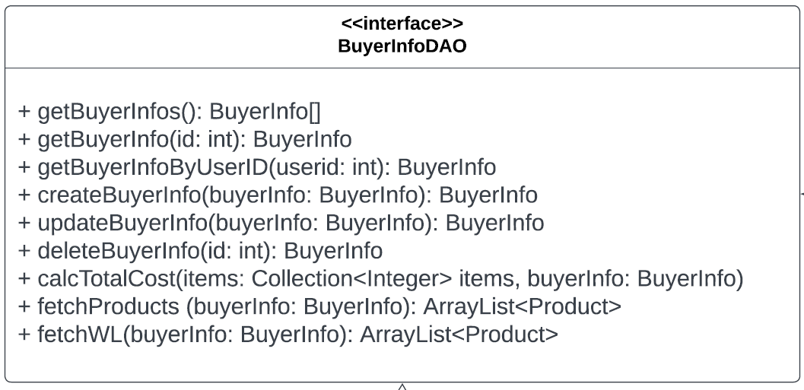
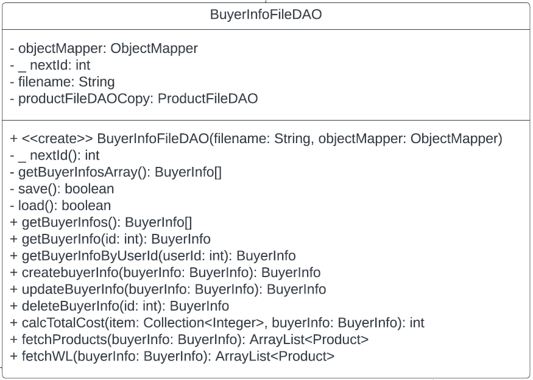

## OO Design Principles

### Controller (Grasp pattern)

We have a Product/inventory Controller class that has Product DAO class and applies rest api. I think we should have a user controller class that allows the user object to conform to the rest api.

### Dependency inversion principle

Product file DAO implements ProductDAO interface class which allows more specific product type to be defined. I think that the ProductDAO interface could extend a bigger restAPI interface that is a generic interface containing functions like get, create, update, delete, etc. This way we can just throw a productDAO class and have it adhere to the rest api automatically and reduce code repetitions for every item or type of object that we can fetch from the backend. This can also allow the attributes of the product to be individually fetchable making packet size smaller.

### Single Responsibility Principle

This principle is applied in our design extensively in our UI code. Every element that has different routing or functionality from one another has its own angular component, which accomplishes one task. This could be improved on the back end, where we have some classes which do a lot more things than they should be doing. If we created more back end classes, no matter how small, we could create less bloated classes.

### Open/Closed Principle

This principle is also applied extensively in our code, as most of our methods created for the back end are closed, as they carry out their intended purpose without the need to ever be updated or changed, such as the http requests for products. In the future, we could probably design the UI side to be more closed to refactoring, by adding more components which do specific things. Most of our files are open to extension as well, but some back end files are too bloated to have further extensions.

## Static Code Analysis/Future Design Improvements

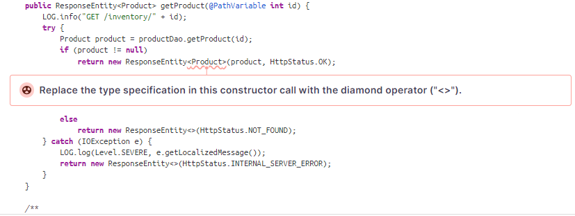

In this example, SonarQube detected that the specification for the ResponseEntity was already implied with the constructor call because of its parameter “product” being passed in. This was present among all the Controllers in the API, so these types of smells were very much scattered across all the files. We can simply just replace these with an empty “<>” to fix these issues.

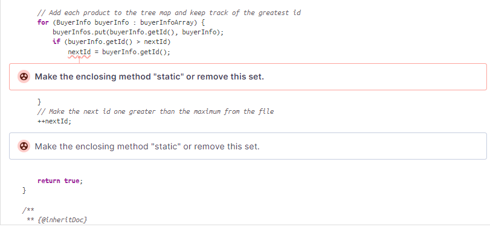

This example shows SonarQube catching how nextId is part of a non-static method. While this is allowed it usually isn’t best practice because it breaks the encapsulation principle since your accessing the variable across multiple instances although we rarely did this making this method static makes it efficient since the method is now not tied to a specific instance of a class. By making these methods static can fix this issue.

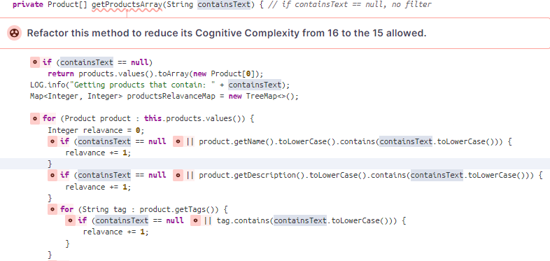

This example shows that the getProductsArray is a little confusing due to the method being hard to follow. SonarQube identifies that the if statements are what makes it confusing especially with the long conditional, this can be shortened down if we modify certain methods. We can separate the “containsText == null” statement since this is a constant for all of these if statements and we can separate include the toLowerCase() method in the getName() method in product and getDescription in product to get rid of the clunkiness in the method.

## Testing

### Acceptance Testing
Stories that passed all tests: 13

Stories that have some tests failing: 3

Stories that have all tests failing: 0

The stories that had some tests fail were user authentication, buyers seeing a list of products, and the admin page. At the time, there were problems with the frontend making a connection to the backend which have been fixed. There are no longer any concerns with the functionality of these stories as they have all been resolved, and further testing was performed with no issues.

### Unit Testing and Code Coverage
Our unit testing strategy consisted of creating the actual file first, and then writing unit tests afterwards. We would periodically check the Jacoco reports and write tests for any lines of code that weren’t covered. Our current coverage is around 86% which is slightly lower than expected due to some last minute file changes. Our main coverage target was to reach 90%, which was originally achieved, but upon editing of some files for optimization purposes before release, caused some of the tests to fail, as they were testing the wrong areas of the code.

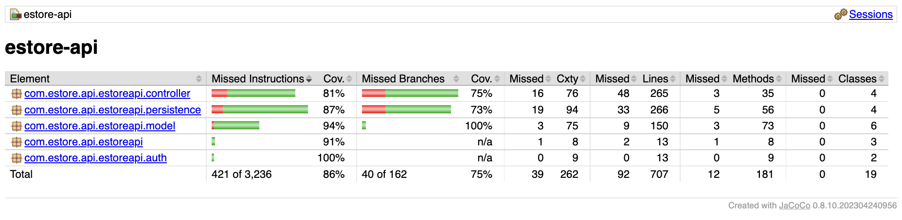

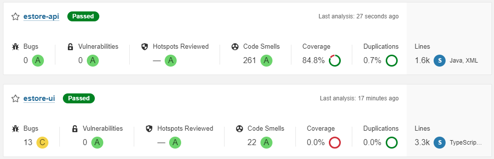

